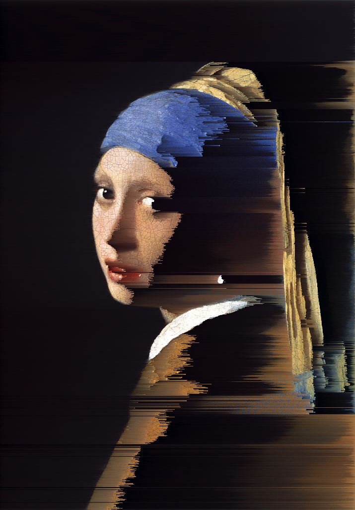

# Quiz 8 - Design Research
_Tom Studley - tstu0632_
&nbsp;
&nbsp;
## Part 1: Pixel Sorting Effect
Pixel sorting is a glitch art imaging effect that rearranges pixels in an image based on those pixels properties. It creates an abstract and dynamic aesthetic where parts of the image remain the same while others become distorted. 

&nbsp;
&nbsp;

_The Starry Night after colour sorting_
&nbsp;
&nbsp;

_Girl with The Pearl Earring after brightness sorting_
&nbsp;

This technique will benefit our major assignment since it can be easily used alongside perlin noise. It can be randomised and can paired with time-based animation. I am interested in using it to explore the deconstruction and reconstruction of an image at an 'atomic' level.
&nbsp;
&nbsp;

## Part 2: Implementation
To implement pixel sorting in p5.js, the approach will involve loading the pixel data of an image and rearranging them based on a specific criterion. This can be achieved by:
&nbsp;
&nbsp;
                  __1. Creating a pixel array__
                  __2. Applying a sorting algorithm__
                  __3. Updating the canvas__
&nbsp;
&nbsp;
There are countless possibilities for the implementation of a sorting algorithm. It can influence elements of directionality, colour, brightness, animation, area-specificity, and randomisation. You can see one great code example combining some of these elements [here](https://happycoding.io/tutorials/p5js/images/pixel-sorter) creating a dynamic effect. Its outcome is demonstrated in the gif below. 
&nbsp;
&nbsp;

_Lighter pixels are moved up, and darker pixels are moved down._

